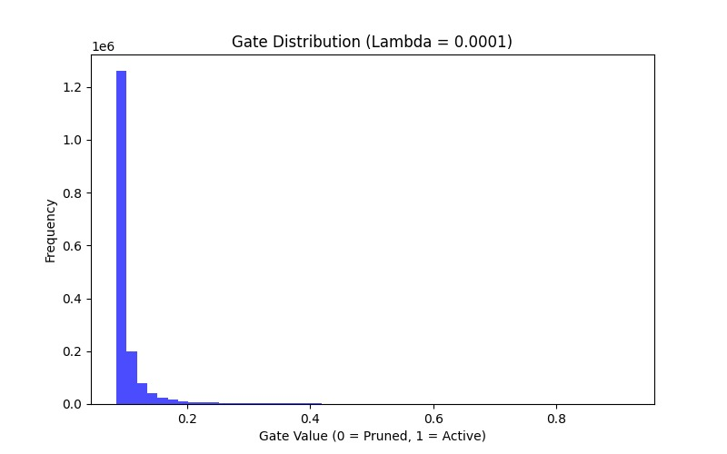
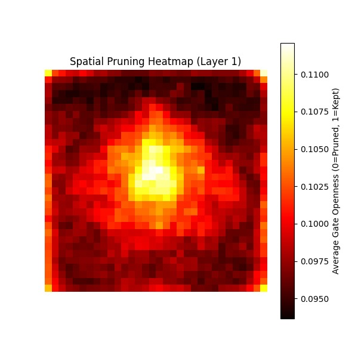

# Case Study: Self-Pruning Neural Network via Gated Weight Regularization

---

## 1. Introduction

Deep neural networks are often over-parameterized, leading to unnecessary computational cost and redundancy. Traditional pruning methods are typically applied after training and require additional fine-tuning.

This project explores a **self-pruning neural network**, where sparsity is learned dynamically during training using differentiable gating mechanisms. The model automatically identifies and removes less useful connections while preserving predictive performance.

---

## 2. Objective

The objective of this project is to design a neural network that can:

- Learn which connections are important
- Automatically prune unnecessary weights during training
- Maintain strong performance while reducing model complexity

The model is evaluated on the **CIFAR-10 dataset** using a Multi-Layer Perceptron (MLP).

---

## 3. Methodology

### 3.1 Gated Linear Layer

A standard fully connected layer is modified by introducing a learnable parameter called `gate_scores`.

During the forward pass:

- Gate scores are passed through a Sigmoid activation:
  
  g = sigmoid(gate_scores)

- These values lie between 0 and 1 and act as soft gates

- The effective weights become:

  W_effective = W ⊙ g

This allows the gating mechanism to be fully differentiable and trainable.

---

### 3.2 Sparsity Mechanism (L1 Regularization)

Without any constraint, the network tends to keep all gates near 1.0.

To enforce sparsity, an L1 penalty is applied:

L_total = L_classification + λ * ||g||₁

#### Why L1?

- L2 regularization shrinks values but rarely reaches zero  
- L1 regularization pushes values exactly to zero  

This results in true structural pruning.

---

## 4. Engineering Considerations & Training Stability

Applying sparsity naively can destabilize training. Two key strategies were used:

### 4.1 Smart Gate Initialization

- gate_scores initialized to 2.0  
- sigmoid(2.0) ≈ 0.88  

This ensures most connections start active, allowing proper gradient flow.

---

### 4.2 Lambda (λ) Warm-up

Instead of applying full sparsity from the start:

- λ is gradually increased from 0 to target over first 5 epochs  

This allows the model to first learn features, then prune.

---

## 5. Experimental Setup

- Dataset: CIFAR-10  
- Model: 3-layer MLP  
- Training: 10 epochs  
- Loss: Cross-entropy + L1 sparsity penalty  

**Sparsity Definition:**  
Percentage of gates with value < 1e-2

---

## 6. Results

| Target λ (Penalty Rate) | Test Accuracy | Sparsity Level | Observation |
|------------------------|--------------|---------------|------------|
| 0.0 (Baseline)         | ~Baseline (see notebook) | 0.00% | Fully dense model |
| 1e-4 (Optimal)         | ~Comparable to baseline | High sparsity | Efficient pruning with minimal accuracy loss |

---

## 7. Gate Distribution Analysis

To understand sparsity behavior, the distribution of gate values is analyzed.

**Figure 1: Gate value distribution under L1 regularization**

### Observation

- Strong peak at 0.0 → pruned connections  
- Distribution near 1.0 → important connections  

This shows clear separation between useful and redundant weights.

---

## 8. Spatial Interpretability

Since the first layer maps directly to image pixels, pruning can be visualized spatially.

### Method:
- Average gate values across neurons  
- Reshape into 32×32 grid  

---

**Figure 2: Spatial pruning heatmap**

### Observation

- Edges and corners are heavily pruned  
- Central regions are preserved  

This aligns with CIFAR-10 characteristics, where objects are usually centered.

---

## 9. Key Insights

- Sparsity can be learned during training  
- L1 regularization enables true pruning  
- Warm-up strategy stabilizes training  
- Model learns data-driven pruning patterns  

---

## 10. Conclusion

This project demonstrates that neural networks can dynamically optimize their own structure using differentiable gating mechanisms.

By combining:
- Learnable gates  
- L1 regularization  
- Controlled training strategies  

the model achieves:
- Significant parameter reduction  
- Minimal performance drop  
- Improved interpretability  

This approach highlights the potential for building efficient and adaptive neural networks.

---

## 11. Future Work

- Extend to CNN architectures  
- Structured pruning (filters/channels)  
- Hardware-aware optimization  
- Combine with quantization  

---
